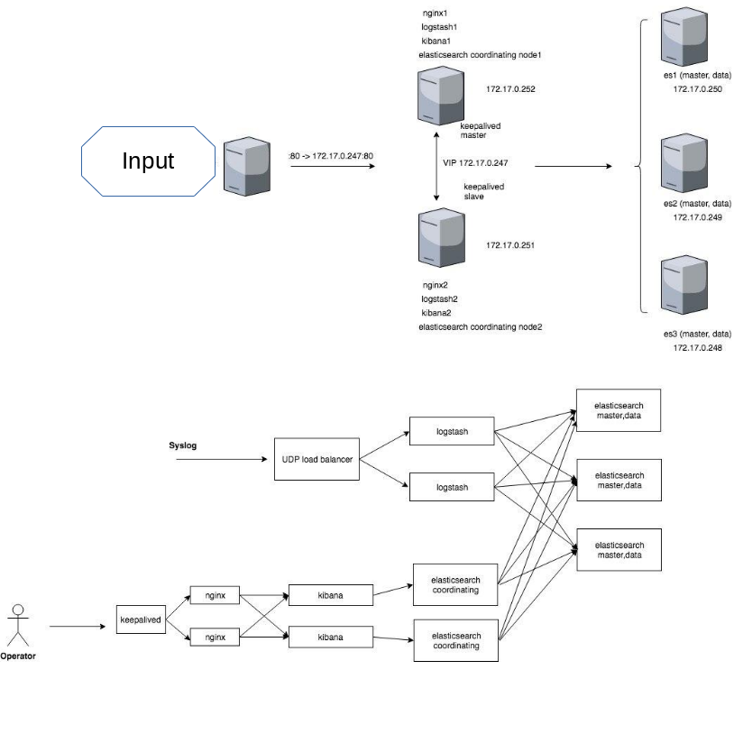

A set of ansible roles and playbooks allowing to setup ELK cluster on Ubuntu VMs.
It was created to check HA based on [Keepalived](http://www.keepalived.org/) with ELK.

Here you can see sketch of a sytem is being deployed:

